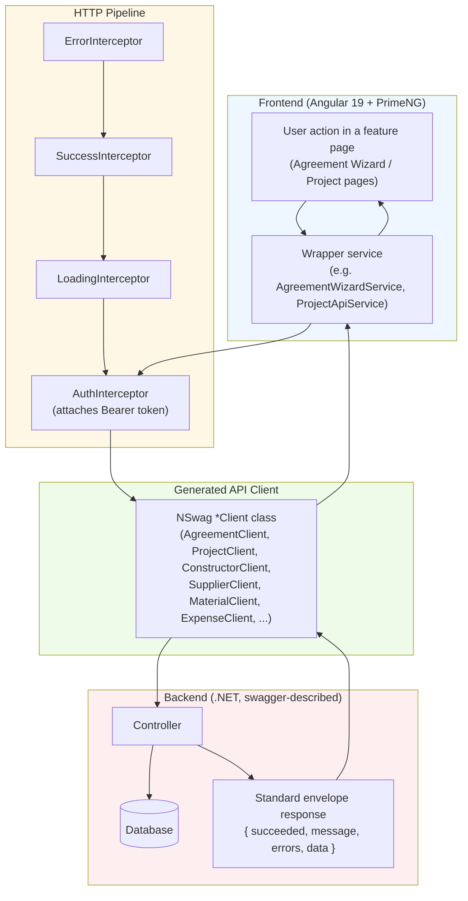
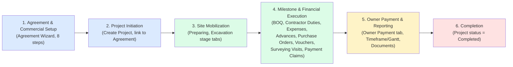
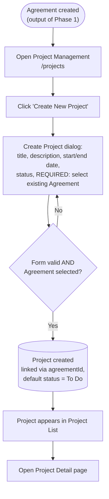
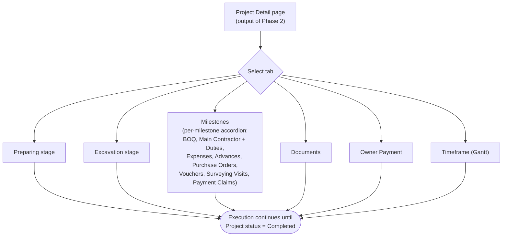
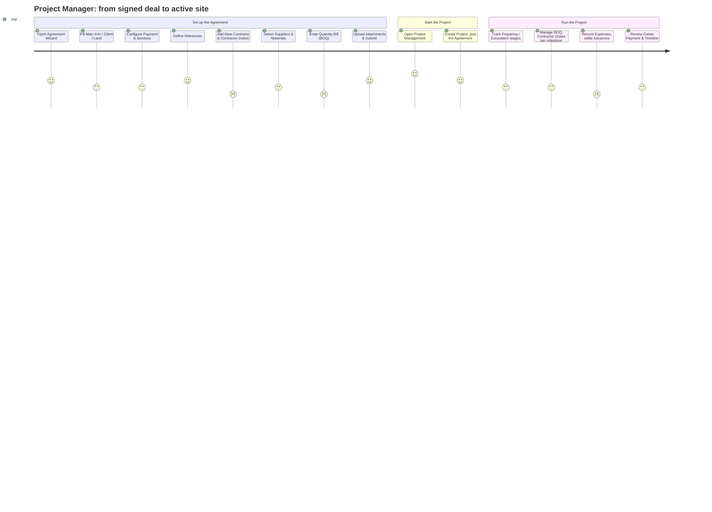
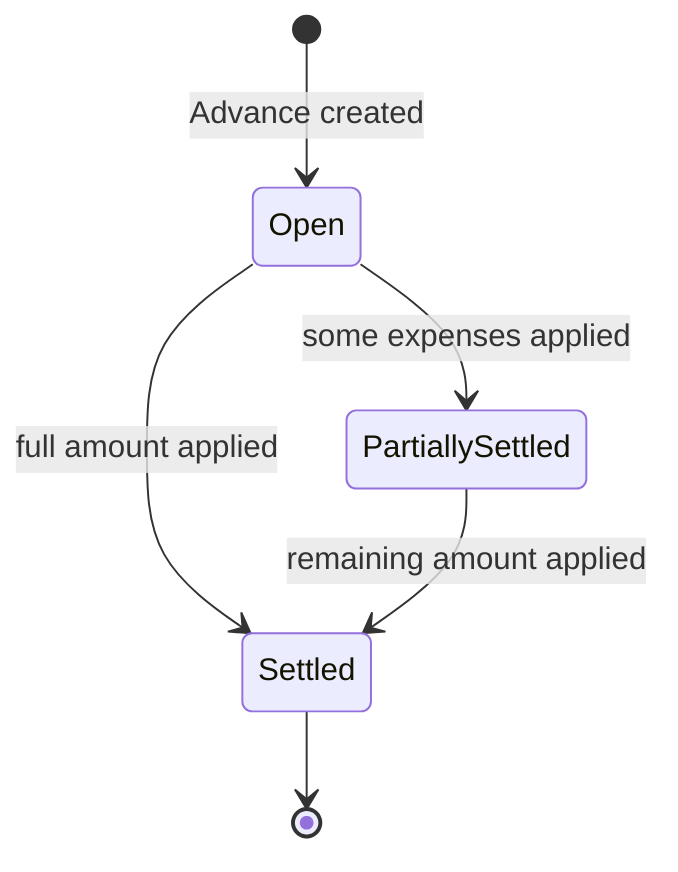
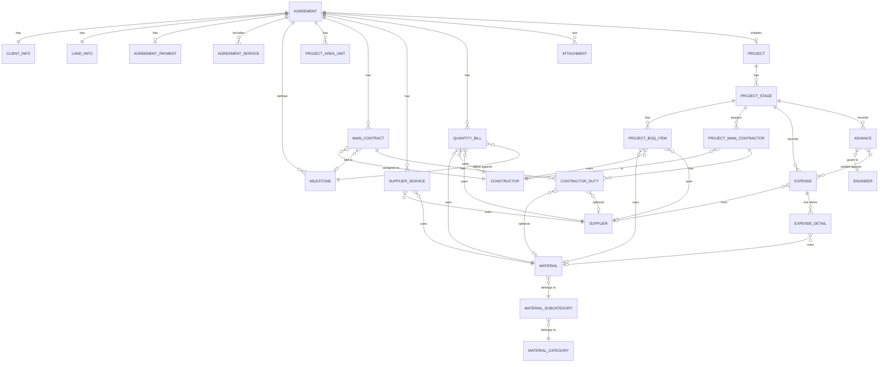

# Construction Project Initiation Workflow — Analysis

> Code-verified analysis of how a construction project is set up and moves into execution in this codebase. Confirmed findings are cited with file paths and line numbers; anything not directly observable in the code is called out under **Assumptions / Missing Information** rather than presented as fact.

## Project Understanding Summary

**Management Platform FE** is an Angular 19 / PrimeNG 19 web application for managing **construction projects** end‑to‑end — from the initial commercial agreement with a client, through contractor/supplier/material setup, to on‑site execution, financial tracking (expenses, advances, owner payments) and reporting. It is bilingual (English/Arabic, RTL‑aware) and talks to a .NET backend (`http://62.84.178.178:8102`) through a fully **generated** HTTP client ([src/nswag/api-client.ts](../src/nswag/api-client.ts)).

The system is built around two cooperating "master" records:
- **Agreement** — the commercial/contractual record (client, land, payment terms, milestones, contracts, suppliers, materials, quantity bill, attachments), created through an 8‑step wizard.
- **Project** — the execution record, which **must reference an existing Agreement**, and is where day‑to‑day site management happens (stages, BOQ, contractor duties, expenses, advances, owner payments, timeline).

Primary users are internal staff of a construction/engineering firm: a **Project Manager** who sets up agreements and projects, an **Admin** with full access, an **Accountant** role that is defined but not yet wired up, and a read‑only **Viewer**. There is no client-facing portal — the whole app sits behind a login (`AuthGuard`).

This report is based entirely on the current code (verified with file/line citations) and a handful of `docs/*.md` files that turned out to be **partially stale** relative to the actual implementation (confirmed by cross‑checking against code and recent commits) — discrepancies are called out explicitly rather than presented as fact.

## Main Modules

| Module | Route | Purpose |
|---|---|---|
| **Dashboard** | `/dashboard` | Landing page, summary widgets (mock data) |
| **Agreement Wizard** | `/agreement-wizard` | 8‑step wizard that creates the commercial **Agreement** (client, contract, milestones, contractors, suppliers, materials, BOQ, attachments) — [app.routes.ts:54-82](../src/app/app.routes.ts#L54-L82) |
| **Project Management** | `/projects` | Creates a **Project** linked to an Agreement; hosts the full execution lifecycle (stages, BOQ, contractor duties, expenses, advances, owner payment, timeframe/Gantt) — [app.routes.ts:84-97](../src/app/app.routes.ts#L84-L97) |
| **Constructor** (Contractors) | `/constructor` | Master data for contractors/constructors and their type — [app.routes.ts:99-117](../src/app/app.routes.ts#L99-L117) |
| **Supplier** | `/supplier` | Master data for material/service suppliers — [app.routes.ts:119-137](../src/app/app.routes.ts#L119-L137) |
| **Material** | `/materials` | Hierarchical catalog: Category → SubCategory → Material — [app.routes.ts:139-142](../src/app/app.routes.ts#L139-L142) |
| **Analytics / Theme showcase** | `/analytics`, `/theme-showcase` | Secondary/demo screens |
| **Auth** | `/auth/login` | Backend-backed login |

Sidebar navigation only exposes 5 of these (Dashboard, Project Management, Constructors, Suppliers, Materials) — **the Agreement Wizard link is commented out of the sidebar**, even though its route is fully active ([sidebar.component.html](../src/app/shared/components/sidebar/sidebar.component.html)). Today, an agreement is therefore reached only via direct URL or as a step the create‑project flow depends on.

## Key Roles

Defined in [auth.models.ts:108-155](../src/app/core/auth/models/auth.models.ts#L108-L155):

| Role | Has a mock account? | Typical permissions |
|---|---|---|
| **Admin** | Yes | All permissions (`projects.*`, `agreements.*`, `constructors.*`, `suppliers.*`, `materials.*`, `users.*`) |
| **ProjectManager** | Yes | View/create/edit (not delete) on projects & agreements; view‑only on constructors/suppliers/materials |
| **Accountant** | **No** — defined in the `Roles` constant but no mock user, no permission set, no usage anywhere in the app | Unknown / not yet designed |
| **Viewer** | Yes | View‑only everywhere |

Two important findings on enforcement:
- Routes carry **no role/permission guards** — only a blanket `AuthGuard`/`GuestGuard` ([app.routes.ts:15](../src/app/app.routes.ts#L15), [:35](../src/app/app.routes.ts#L35)). Any authenticated user can reach any screen.
- The `*appHasPermission` / `*appHasRole` directives exist ([has-permission.directive.ts](../src/app/core/auth/directives/has-permission.directive.ts), [has-role.directive.ts](../src/app/core/auth/directives/has-role.directive.ts)) but a codebase‑wide search found **zero usages** outside their own definition files — they are not applied to any button, menu item, or form in the project/agreement flow today.

Beyond these four account roles, two **domain roles** appear as data, not as login accounts:
- **Resident Engineer** — a person record used only inside the Advances feature ([advance.model.ts:99-103](../src/app/features/project-management/models/advance.model.ts#L99-L103)), with a code comment noting the backend has no real lookup for it yet.
- **Client / Contact Person / Representative** — captured as free‑text fields inside Agreement Step 1, not a standalone "Client" master‑data module.

There is **no "Consultant" role or module** anywhere in the codebase.

## Construction Project Initiation Workflow

### High-Level System Flow

Every mutation (create agreement step, create project, add contractor duty, settle advance, etc.) follows this same path. `SuccessInterceptor` treats `succeeded:false` as an error even on HTTP 200, and `AuthInterceptor` transparently refreshes an expired token and retries once before forcing logout (per [CLAUDE.md](../CLAUDE.md) and confirmed client registration in [app.config.ts:72-87](../src/app/app.config.ts#L72-L87)).

### Business Process Flow

This is the business-level shape of what the code implements. **Note:** the system has no CRM/lead‑capture stage — the first business event the software records at all is Agreement Step 1; anything that happens before that (sales, RFQ, tendering) is outside this application (see Assumptions).

## Mermaid Flowchart

This is the detailed, code‑accurate flow from "create an agreement" through "project is being executed," split into its three natural phases so each diagram stays readable.

### Phase 1 — Agreement Wizard (8 steps, linear, no approval gate)

```mermaid
flowchart TD
    Start(["Start: User logs in"]) --> Auth{"Authenticated?"}
    Auth -- No --> Login["Login page /auth/login"] --> Auth
    Auth -- Yes --> Dash["Dashboard"]
    Dash --> AWList["Open Agreement List<br/>/agreement-wizard"]
    AWList --> NewAgr["Click 'Add New Agreement'"]
    NewAgr --> S1["Step 1: Main Info<br/>Agreement + Client + Land details"]
    S1 --> V1{"Required fields<br/>valid?"}
    V1 -- No --> S1
    V1 -- Yes --> C1[("Agreement record created<br/>isSubmitted = true")]
    C1 --> S2["Step 2: Payment Details<br/>Contract type/model, payment method, services"]
    S2 --> V2{"Valid?"}
    V2 -- No --> S2
    V2 -- Yes --> S3["Step 3: Milestones<br/>(name, order, description)"]
    S3 --> V3{"At least 1<br/>milestone?"}
    V3 -- No --> S3
    V3 -- Yes --> S4["Step 4: Project Areas<br/>(annex, unit, amount)"]
    S4 --> V4{"Valid?"}
    V4 -- No --> S4
    V4 -- Yes --> S5["Step 5: Main Contracts<br/>+ Contractor Duties dialog<br/>(material, supplier, generateExpense)"]
    S5 --> V5{"At least 1<br/>contract?"}
    V5 -- No --> S5
    V5 -- Yes --> S6["Step 6: Supplier &amp; Material Selection"]
    S6 --> V6{"Valid?"}
    V6 -- No --> S6
    V6 -- Yes --> S7["Step 7: BOQ / Quantity Bill<br/>line items"]
    S7 --> V7{"Valid?"}
    V7 -- No --> S7
    V7 -- Yes --> S8["Step 8: Attachments upload"]
    S8 --> Submit["Final submit<br/>(createAgreement, step=8)"]
    Submit --> Success["Agreement Success page"]
    Success --> AgreementDone(["Agreement now listed<br/>in Agreement List"])
```

### Phase 2 — Project Initiation

### Phase 3 — Execution (Project Detail tabs)

## Step-by-Step Explanation

| # | Screen / Action | What happens | Responsible role | Effect on status |
|---|---|---|---|---|
| 1 | **Login** | User authenticates; `AuthGuard` protects everything past this point ([app.routes.ts:35](../src/app/app.routes.ts#L35)) | Any user | n/a |
| 2 | **Agreement List → "Add New Agreement"** | Navigates to `/agreement-wizard/create` ([agreement-list.component.ts](../src/app/features/agreement-wizard/pages/agreement-list/agreement-list.component.ts)) | Admin / ProjectManager (no enforced restriction today) | Agreement does not exist yet |
| 3 | **Step 1 — Main Info** | Collects Agreement info (name, sector, dates, country/city, area), Client info (contact person, representative), Land info (basin, village, directorate, plot, floor). On valid submit, the system **creates the Agreement row immediately** and sets `isSubmitted = true` | ProjectManager/Admin | Agreement created |
| 4 | **Step 2 — Payment Details** | Contract type/model (Fixed Price, Time & Materials, Cost Plus / Lump Sum, Unit Price, Percentage), payment method, selected services | Same | Agreement updated (step=2) |
| 5 | **Step 3 — Milestones** | Define named milestones with order/description — these become the backbone that contracts, BOQ lines and quantity bills attach to later | Same | Agreement updated (step=3) |
| 6 | **Step 4 — Project Areas** | Table of area/annex/unit/amount entries | Same | Agreement updated (step=4) |
| 7 | **Step 5 — Main Contracts** | Add one or more contracts with a Constructor (contractor), total amount, start/end date; each contract opens a **Contractor Duties dialog** to add duty line items (quantity, price, unit, duty type/responsibility, optional material + supplier, and a `generateExpense` flag that auto‑creates an expense) | Same | Agreement updated (step=5) |
| 8 | **Step 6 — Supplier & Material Selection** | Table linking a Supplier + Material (+ representative) to the agreement, using the shared Material Select component | Same | Agreement updated (step=6) |
| 9 | **Step 7 — BOQ / Quantity Bill** | Table of quantity‑bill line items: material, unit, milestone, constructor, supplier, quantity, price (auto‑calculated subtotal) | Same | Agreement updated (step=7) |
| 10 | **Step 8 — Attachments** | Upload supporting files (base64‑encoded); final call to `createAgreement` with `step=8` | Same | Agreement considered complete → redirect to success page |
| 11 | **Create Project dialog** | A **separate, simpler** form: title, description, start/end date, status, and a **required dropdown of existing Agreements** ([create-project-dialog.component.ts:81-89](../src/app/features/project-management/components/dialog/create-project-dialog/create-project-dialog.component.ts#L81-L89)) | ProjectManager/Admin | Project created, `agreementId` set, default status "To Do" |
| 12 | **Project Detail — execution tabs** | Overview (static demo Kanban), Preparing, Excavation, Milestones (accordion of BOQ / Main Contractor & Duties / Expenses / Advances / Purchase Orders / Vouchers / Surveying Visits / Payment Claims / Documents), Documents, Owner Payment, Timeframe (Gantt) | ProjectManager, site/financial staff | Project status changes manually as work progresses |

No node in this flow represents a **review/approval gate** — see Status Lifecycle and Assumptions below.

### User Journey Flow (Project Manager persona)

*(Satisfaction scores 1–5 are illustrative, reflecting relative form/step complexity observed in the code — not measured user data.)*

## Status Lifecycle

Three independent, **not fully reconciled** status models exist in the code:

**1. Agreement** — no real status enum. Only two booleans on `AgreementDto`: `isSubmitted` and `isDeleted` ([api-client.ts:6047-6050](../src/nswag/api-client.ts)). `isSubmitted` flips to `true` as early as Step 1, so it indicates "has at least been started," not "fully approved."

**2. Project — two different enums are in play:**
- The **real one sent to the backend** on creation, `ProjectStatus` from the generated client: `_0 = To Do`, `_1 = In Progress`, `_2 = Review`, `_3 = Completed` ([create-project-dialog.component.ts:51-56](../src/app/features/project-management/components/dialog/create-project-dialog/create-project-dialog.component.ts#L51-L56)).
- A **legacy, hand‑written enum** used purely for the status badge on the Project Detail header: `PLANNING / IN_PROGRESS / ON_HOLD / COMPLETED / CANCELLED` ([project.model.ts:24-30](../src/app/features/project-management/models/project.model.ts#L24-L30), used in [project-detail.component.ts:168-192](../src/app/features/project-management/pages/project-detail/project-detail.component.ts#L168-L192)).

These two do not line up one‑to‑one (e.g. "Review" exists only on the backend side; "On Hold"/"Cancelled" exist only on the legacy display side) — flagged below as a recommendation.

**3. Stage** — `StageStatus`: `PREPARING → EXCAVATION → FOUNDATION → STRUCTURE → FINISHING → MILESTONE → COMPLETED` ([project.model.ts:51-59](../src/app/features/project-management/models/project.model.ts#L51-L59)). Only **Preparing**, **Excavation** and **Milestone** currently have a working tab in the UI; Foundation/Structure/Finishing have no dedicated screen yet.

**4. Task** — `TaskStatus`: `TODO → IN_PROGRESS → REVIEW → BLOCKED → COMPLETED` ([project.model.ts:63-69](../src/app/features/project-management/models/project.model.ts#L63-L69)).

**5. Advance** (resident‑engineer cash advance) — `'Open' → 'PartiallySettled' → 'Settled'` ([advance.model.ts:24](../src/app/features/project-management/models/advance.model.ts#L24)). Only `Open` advances can be edited; `Open`/`PartiallySettled` can be settled against expenses.

**6. Expense locking** (not a status field, but a derived lock): an expense is **locked from editing/deleting** if `autoPost = true` (auto‑posted by a contractor duty with `generateExpense`) **or** if it has been applied to settle an Advance ([project-expense-management.component.ts:182-195](../src/app/features/project-management/components/project-expense-management/project-expense-management.component.ts)).

## Important Screens / Pages

| Page | Route | Component file |
|---|---|---|
| Agreement List | `/agreement-wizard` | [agreement-list.component.ts](../src/app/features/agreement-wizard/pages/agreement-list/agreement-list.component.ts) |
| Agreement Wizard (create/edit/view) | `/agreement-wizard/create`, `/edit/:id`, `/view/:id` | [agreement-wizard.component.ts](../src/app/features/agreement-wizard/components/agreement-wizard.component.ts) |
| ↳ Steps 1–8 | n/a | `components/steps/step1` … `step7`, `step-milestones` |
| Agreement Success | `/agreement-wizard/success` | [agreement-success.component.ts](../src/app/features/agreement-wizard/pages/agreement-success/agreement-success.component.ts) |
| Project List | `/projects` | [project-list.component.ts](../src/app/features/project-management/pages/project-list/project-list.component.ts) |
| Create Project Dialog | (modal on Project List) | [create-project-dialog.component.ts](../src/app/features/project-management/components/dialog/create-project-dialog/create-project-dialog.component.ts) |
| Project Detail | `/projects/:id` | [project-detail.component.ts](../src/app/features/project-management/pages/project-detail/project-detail.component.ts) |
| ↳ Milestones (BOQ, Main Contractor/Duties, Expenses, Advances, Purchase Orders, Vouchers, Surveying Visits, Payment Claims, Documents) | (tab) | [milestone-stage.component.ts](../src/app/features/project-management/components/milestone-stage/milestone-stage.component.ts) + `tabs/*` |
| Constructor List / Form | `/constructor`, `/constructor/new`, `/constructor/edit/:id` | [constructor-list.component.ts](../src/app/features/constructor/pages/constructor-list/constructor-list.component.ts), [constructor-form.component.ts](../src/app/features/constructor/pages/constructor-form/constructor-form.component.ts) |
| Supplier List / Form | `/supplier`, `/supplier/new`, `/supplier/edit/:id` | [supplier-list.component.ts](../src/app/features/supplier/pages/supplier-list/supplier-list.component.ts), [supplier-form.component.ts](../src/app/features/supplier/pages/supplier-form/supplier-form.component.ts) |
| Material Management | `/materials` | [material-management.component.ts](../src/app/features/material/pages/material-management/material-management.component.ts) |

## Important APIs / Services

NSwag‑generated clients **registered globally** in [app.config.ts:72-84](../src/app/app.config.ts#L72-L84): `AgreementClient`, `AttachmentClient`, `LookupClient`, `ProjectClient`, `TaskClient`, `SubTaskClient`, `ConstructorClient`, `SupplierClient`, `ExpenseClient`, `CurrencyClient`, `MaterialClient`, `MaterialCategoryClient`, `MaterialSubCategoryClient`.

Additional clients confirmed in use but registered **per-component** instead (e.g. `providers: [ProjectBOQClient, LookupClient, ConstructorClient, SupplierClient]` in [boq-tab.component.ts:38](../src/app/features/project-management/components/milestone-stage/tabs/boq-tab/boq-tab.component.ts#L38)): `ProjectBOQClient`, `ProjectMainContractorClient`, `ProjectMainContractorDutyClient`.

| Wrapper service | Delegates to | Key methods |
|---|---|---|
| [agreement-wizard.service.ts](../src/app/features/agreement-wizard/services/agreement-wizard.service.ts) | `AgreementClient`, `AttachmentClient`, `LookupClient`, `ConstructorClient` | `createAgreement`, `getAllAgreements`, `getAgreementById`, `getStep1Lookups…getStep6Lookups`, attachment up/download/delete |
| [project-api.service.ts](../src/app/features/project-management/services/project-api.service.ts) | `ProjectClient` | `createProject`, `getAllProjects`, `getProjectById` |
| [project.service.ts](../src/app/features/project-management/services/project.service.ts) | raw `HttpClient` (not NSwag) | `getProjects`, `getProjectById`, status mapping for display |
| [boq-api.service.ts](../src/app/features/project-management/services/boq-api.service.ts) | `ProjectBOQClient` | `createOrUpdate`, `delete`, `getById`, `getByStageId` |
| [expense-api.service.ts](../src/app/features/project-management/services/expense-api.service.ts) | `ExpenseClient` | `createOrUpdate`, `delete`, `getByProjectStageId`, `getById` |
| [advance-api.service.ts](../src/app/features/project-management/services/advance-api.service.ts) | **mock data** (`environment.advances.useMock`) | `getByProjectStageId`, `create`, `update`, `settle`, `getAvailableExpenses`, `getEngineers` |
| [task.service.ts](../src/app/features/project-management/services/task.service.ts) | `TaskClient` | `getAllTasks`, `createTask`, `updateTaskStatus`, `deleteTask` |
| Constructor / Supplier / Material services | `ConstructorClient` / `SupplierClient` / `MaterialClient`+`MaterialCategoryClient`+`MaterialSubCategoryClient` | standard `getAll/getById/createOrUpdate/delete` |

## Data Entities Involved

**Confirmed entities & their source:**
- **Agreement / Client info / Land info** — [step1.component.ts](../src/app/features/agreement-wizard/components/steps/step1/step1.component.ts), `FirstStepDto` ([api-client.ts:9447](../src/nswag/api-client.ts))
- **Milestone** — `MileStonesDto`, reused across MainContract/BOQ/QuantityBill
- **Main Contract / Contractor Duty** — `MainContractDto` ([api-client.ts:14627](../src/nswag/api-client.ts)), `ContractorDutyDto` ([api-client.ts:7151](../src/nswag/api-client.ts))
- **Supplier Service** — `SupplierServiceDto` ([api-client.ts:18172](../src/nswag/api-client.ts))
- **Quantity Bill** (agreement‑level BOQ) — `QuantityBillDto` ([api-client.ts:17285](../src/nswag/api-client.ts))
- **Project / Project Stage** — [project.model.ts](../src/app/features/project-management/models/project.model.ts), `ProjectStageDto`
- **Project BOQ** (execution‑level BOQ, separate from Quantity Bill) — [boq.model.ts](../src/app/features/project-management/models/boq.model.ts), `GetProjectBOQDto` ([api-client.ts:11743](../src/nswag/api-client.ts))
- **Constructor, Supplier, Material/Category/SubCategory** — own feature modules, each with full CRUD
- **Expense / Expense Detail** — [project-expense-management.component.ts](../src/app/features/project-management/components/project-expense-management/project-expense-management.component.ts)
- **Advance / Engineer (lookup only)** — [advance.model.ts](../src/app/features/project-management/models/advance.model.ts)

Two BOQ‑like entities exist for two different purposes: **QuantityBill** is the agreement‑level estimate captured during wizard Step 7, and **Project BOQ** is a separate execution‑level record tracked per project stage. They are not the same table and are not automatically derived from one another in the code reviewed.

## Assumptions / Missing Information

These are explicitly **not confirmed** in the codebase and should not be treated as fact:

- **No client/CRM module**: there's no entity or screen for managing a "Client" as master data (name/contacts repeated per agreement) — client details are just free‑text fields on the Agreement.
- **No Consultant module or role** exists anywhere in the code.
- **"Resident Engineer"** is only a name lookup inside Advances, with a code comment admitting the backend hasn't decided how to expose it yet ([mock-advances.data.ts:17-19](../src/app/features/project-management/services/mock-advances.data.ts)) — not a real HR/user entity.
- **No Permit entity**: "Permits & Approvals" appears only as a static Kanban column label in the (sample‑data‑only) Overview tab ([stage-kanban.component.ts:56](../src/app/features/project-management/components/stage-kanban/stage-kanban.component.ts#L56)) — there is no Permit model, service, or screen.
- **No formal approval/review workflow** for either Agreement or Project. The "Review" value in the backend `ProjectStatus` enum and the "Review" Kanban column suggest a review step was *intended*, but no code enforces it, assigns a reviewer, or blocks progress pending approval.
- **Whether the backend auto-creates default Project Stages** (Preparing/Excavation/Milestones) on project creation could not be confirmed — the frontend only fetches stages by ID, it doesn't create them, so this logic (if it exists) lives entirely server-side.
- **Advances run on mock data today** (`environment.advances.useMock`) — there is no generated `AdvanceClient`, meaning the backend endpoint may not exist yet ([advance-api.service.ts:40](../src/app/features/project-management/services/advance-api.service.ts#L40)).
- **Overview/Kanban tab and the Staging Board** described in [docs/STAGING_BOARD_IMPLEMENTATION.md](STAGING_BOARD_IMPLEMENTATION.md) are aspirational — the live Overview tab renders hardcoded sample cards, and the route for the richer staging board is commented out in [project-detail.component.html:138-143](../src/app/features/project-management/pages/project-detail/project-detail.component.html#L138-L143).
- [docs/PROJECT_MANAGEMENT.md](PROJECT_MANAGEMENT.md) describes an older, simpler single‑dialog project model (no agreement link, no milestones) — superseded by the current code but never updated.
- User‑journey satisfaction scores in this report are illustrative only, not measured/telemetry data.

## Recommendations to Improve the Flow or Documentation

1. **Reconcile the two Project status enums.** The backend (`To Do/In Progress/Review/Completed`) and the legacy display enum (`Planning/In Progress/On Hold/Completed/Cancelled`) don't map cleanly — pick one source of truth and have [project-detail.component.ts](../src/app/features/project-management/pages/project-detail/project-detail.component.ts) read it directly instead of through a guessed mapping.
2. **Decide on, and implement, an actual approval step** if one is required by the business (e.g., an Agreement shouldn't be usable to create a Project until someone with the right permission marks it "Approved"). Right now `isSubmitted` looks like an approval flag but is set on Step 1 of 8, before any commercial detail exists.
3. **Wire up the existing permission model.** `*appHasPermission`/`*appHasRole` and the granular `agreements.create`/`projects.delete`-style permissions are fully defined but unused — either enforce them on the relevant buttons/routes or remove them to avoid a false sense of access control.
4. **Add the Agreement Wizard back into the sidebar**, or confirm intentionally hiding it — since creating a Project now hard‑requires an Agreement, an Admin/PM with no direct nav entry has to know the `/agreement-wizard` URL.
5. **Build the missing stage tabs** (Foundation, Structure, Finishing) or remove them from `StageStatus` if they're no longer planned, since only Preparing/Excavation/Milestone currently have screens.
6. **Refresh `docs/PROJECT_MANAGEMENT.md`, `docs/AGREEMENT_WIZARD.md`, and `docs/STAGING_BOARD_IMPLEMENTATION.md`** — all three describe an earlier version of the feature; keeping them in sync with the code (or deleting superseded ones) would prevent future confusion for new developers.
7. **Standardize API client registration** — most NSwag clients are registered once in [app.config.ts](../src/app/app.config.ts), but a few (`ProjectBOQClient`, `ProjectMainContractorClient`, `ProjectMainContractorDutyClient`) are re‑declared per component. Centralizing avoids creating a new client instance per component and keeps the registration pattern consistent.
8. **Clarify the relationship between agreement‑level "Quantity Bill" and project‑level "Project BOQ."** They look like the same business concept (a bill of quantities) modeled twice; if that's intentional (estimate vs. actuals), documenting it would help; if not, consider consolidating.
